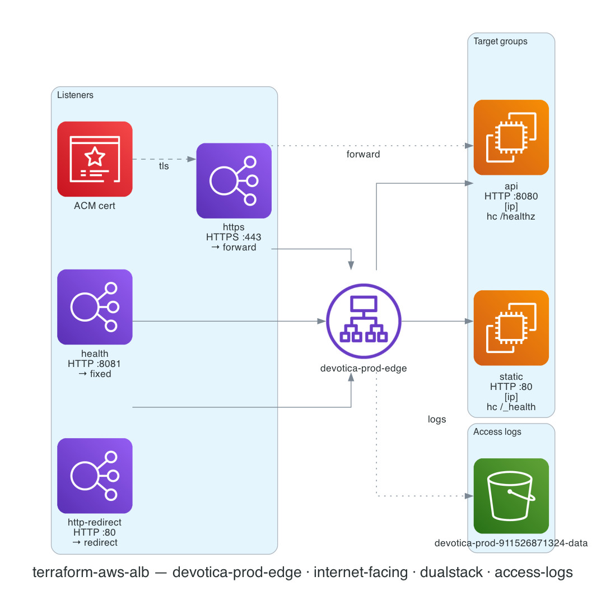

# terraform-aws-alb

[](https://github.com/devotica-labs/terraform-aws-alb/actions/workflows/ci.yml)
[](https://github.com/devotica-labs/terraform-aws-alb/actions/workflows/release.yml)
[](LICENSE)

Production-grade AWS Application Load Balancer module with multi-listener + multi-target-group support and fintech-safe defaults. The standard front door for any HTTP/HTTPS workload (ECS, EKS, EC2 ASGs).

This module follows the Devotica module shape: Apache-2.0 licensed, validated inputs, plan-only unit + contract tests (mock-provider), terraform-docs auto-update, central reusable CI from `devotica-labs/terraform-shared-config`, and signed releases with CycloneDX SBOMs.

<!-- BEGIN_ARCH -->



<sub>Generated by `.github/workflows/architecture-diagram.yml` on every push to main. Do not edit the image by hand — change the Terraform code in `examples/complete/` and the bot will regenerate it.</sub>

<!-- END_ARCH -->

## Scope

| Surface | Covered |
|---|---|
| `aws_lb` (load_balancer_type = application) | ✅ |
| Multi-listener (HTTPS + HTTP-redirect + fixed-response) | ✅ |
| Multi-target-group via map | ✅ |
| `forward` / `redirect` / `fixed-response` default actions | ✅ |
| Validation: HTTPS requires `certificate_arn` | ✅ |
| Validation: `forward` requires `target_group_key` | ✅ |
| Configurable health checks per target group | ✅ |
| Stickiness per target group | ✅ |
| Access logs to S3 (opt-in) | ✅ |
| IPv6 / dualstack | ✅ |
| Deletion protection | ✅ (default on) |
| HTTP-desync mitigation | ✅ (default `defensive`) |
| `drop_invalid_header_fields` | ✅ (default on) |
| TLS 1.3 default SSL policy | ✅ |
| Listener rules (host/path/header routing) | ❌ (planned for v0.2) |
| Listener auth (Cognito / OIDC) | ❌ (planned for v0.2) |
| WAF association | ❌ (planned for v0.2) |
| Mutual TLS | ❌ (planned for v0.3) |
| Network Load Balancer | ❌ (lives in sister module `terraform-aws-nlb`) |

## Quick start

```hcl
module "alb" {
  source  = "devotica-labs/alb/aws"
  version = "~> 0.1"

  name = "my-app-alb"

  vpc_id             = module.vpc.vpc_id
  subnet_ids         = module.vpc.public_subnet_ids
  security_group_ids = [aws_security_group.alb.id]

  target_groups = {
    api = {
      port        = 8080
      target_type = "ip"   # ECS Fargate / EKS
    }
  }

  listeners = {
    https = {
      port                = 443
      protocol            = "HTTPS"
      certificate_arn     = module.acm.certificate_arn
      default_action_type = "forward"
      target_group_key    = "api"
    }
    http-redirect = {
      port                = 80
      protocol            = "HTTP"
      default_action_type = "redirect"
      # redirect defaults to 443 / HTTPS / 301
    }
  }

  tags = {
    Environment = "production"
    Project     = "my-app"
    Owner       = "platform@example.com"
    CostCenter  = "PLATFORM"
    ManagedBy   = "Terraform"
    Repo        = "https://github.com/your-org/your-infra"
  }
}
```

See [`examples/complete`](examples/complete/main.tf) for the full surface (3 listeners, 2 target groups, IPv6 dualstack, access logs to S3).

## Defaults that matter

- **`enable_deletion_protection = true`** — blocks `terraform destroy` and AWS-console delete. Override to `false` for a planned teardown.
- **`drop_invalid_header_fields = true`** — HTTP-smuggling mitigation. RFC 7230 violations are dropped at the LB.
- **`desync_mitigation_mode = "defensive"`** — AWS's recommended balance for the HTTP-desync class of attacks.
- **`enable_http2 = true`** — almost every modern client supports it; improves latency.
- **`preserve_host_header = true`** — apps that depend on the original Host header (multi-tenant routing, signed URLs) need it.
- **Default `ssl_policy = "ELBSecurityPolicy-TLS13-1-2-2021-06"`** — TLS 1.2 / 1.3 modern policy. Drops every cipher with known weakness.
- **HTTPS without `certificate_arn` is refused at validation.**
- **`forward` without `target_group_key` is refused at validation.**
- **Tags**: every taggable resource (ALB, target groups, listeners) gets `ManagedBy = "terraform"` and `Module = "terraform-aws-alb"` merged with `var.tags`.

## How this fits the Devotica catalog

```
terraform-aws-vpc             terraform-aws-s3              future terraform-aws-acm
       │                              │                              │
       │ vpc_id, subnet_ids           │ bucket_id (access_logs)      │ certificate_arn
       ▼                              ▼                              ▼
                              terraform-aws-alb
                                      │
                                      │ target_group_arns
                                      ▼
                              terraform-aws-ecs-fargate
                              (or EC2 ASG, EKS service, …)
```

## Listener default-action shapes

**`forward`** to a target group:
```hcl
default_action_type = "forward"
target_group_key    = "api"      # references var.target_groups["api"]
```

**`redirect`** (default to HTTPS 443 / 301):
```hcl
default_action_type = "redirect"
# All redirect fields default — you only need to override what's different.
redirect = {
  port        = "443"
  protocol    = "HTTPS"
  status_code = "HTTP_301"
}
```

**`fixed-response`** (e.g. a health endpoint that doesn't reach a TG):
```hcl
default_action_type = "fixed-response"
fixed_response = {
  content_type = "text/plain"
  message_body = "ALB OK"
  status_code  = "200"
}
```

## Access logs to S3

Pair with [`devotica-labs/terraform-aws-s3`](https://github.com/devotica-labs/terraform-aws-s3). The bucket policy must allow the **regional ELB service account** (not the global ELB principal) to `PutObject`. AWS publishes the per-region account IDs at [Enable access logs for your Application Load Balancer](https://docs.aws.amazon.com/elasticloadbalancing/latest/application/enable-access-logging.html). For `ap-south-1` (Mumbai), the account is `718504428378`.

## Governance

- CI runs the central reusable workflow from `devotica-labs/terraform-shared-config`: fmt, validate, tflint, tfsec, gitleaks, terraform-docs, conftest against `devotica-labs/terraform-policies`, terraform test, checkov, examples build.
- Releases are cut by `release-please` on Conventional Commits. Each release is keyless-signed via cosign and ships a CycloneDX SBOM.

<!-- BEGIN_TF_DOCS -->


## Usage

### Basic

```hcl
# ---------------------------------------------------------------------------
# Provider block — CI-friendly skip flags + non-AWS-shaped placeholder creds.
# ---------------------------------------------------------------------------
provider "aws" {
  region                      = "ap-south-1"
  access_key                  = "not-a-real-aws-key"
  secret_key                  = "not-a-real-aws-secret"
  skip_credentials_validation = true
  skip_metadata_api_check     = true
  skip_requesting_account_id  = true
}

# Uses local path during development.
# Change to Registry source after first release:
#   source  = "devotica-labs/alb/aws"
#   version = "~> 0.1"

# trivy:ignore:AWS-0053 — the example deliberately shows an internet-facing
# ALB. To turn it internal, set internal = true and place the ALB in
# private subnets. Aliased as aws-elb-alb-not-public in tfsec.
# trivy:ignore:AWS-0054 — the http-redirect listener is the safe HTTP→HTTPS
# redirect pattern; the only forward listener is HTTPS. Aliased as
# aws-elb-http-not-used in tfsec.
module "alb" {
  source = "../.."

  name = "my-app-alb"

  vpc_id             = "vpc-00000000000000000"
  subnet_ids         = ["subnet-aaaaaaaaaaaaaaaaa", "subnet-bbbbbbbbbbbbbbbbb"]
  security_group_ids = ["sg-00000000000000000"]

  target_groups = {
    api = {
      port = 8080
      # Defaults: HTTP, HTTP1, instance, 30s deregistration, sane health checks.
    }
  }

  listeners = {
    https = {
      port                = 443
      protocol            = "HTTPS"
      certificate_arn     = "arn:aws:acm:ap-south-1:123456789012:certificate/00000000-0000-0000-0000-000000000000"
      default_action_type = "forward"
      target_group_key    = "api"
    }
    http-redirect = {
      port                = 80
      protocol            = "HTTP"
      default_action_type = "redirect"
      # Redirect to HTTPS — block defaults already to 443/HTTPS/301.
    }
  }

  tags = {
    Environment = "example"
    Project     = "terraform-aws-alb"
    Owner       = "platform@devotica.com"
    CostCenter  = "PLATFORM-OSS"
    ManagedBy   = "Terraform"
    Repo        = "https://github.com/devotica-labs/terraform-aws-alb"
  }
}
```

### Complete

```hcl
# ---------------------------------------------------------------------------
# Provider block — CI-friendly skip flags + non-AWS-shaped placeholder creds.
# ---------------------------------------------------------------------------
provider "aws" {
  region                      = "ap-south-1"
  access_key                  = "not-a-real-aws-key"
  secret_key                  = "not-a-real-aws-secret"
  skip_credentials_validation = true
  skip_metadata_api_check     = true
  skip_requesting_account_id  = true
}

# Uses local path during development.
# Change to Registry source after first release:
#   source  = "devotica-labs/alb/aws"
#   version = "~> 0.1"

# trivy:ignore:AWS-0053 — the example deliberately shows an internet-facing
# ALB (the production edge). To turn it internal, set internal = true and
# place the ALB in private subnets. Aliased as aws-elb-alb-not-public in tfsec.
# trivy:ignore:AWS-0054 — http-redirect listener is the safe HTTP→HTTPS
# redirect pattern; health listener is fixed-response only and never reaches
# real backends. Aliased as aws-elb-http-not-used in tfsec.
module "alb" {
  source = "../.."

  name = "devotica-prod-edge"

  vpc_id             = "vpc-00000000000000000"
  subnet_ids         = ["subnet-aaaaaaaaaaaaaaaaa", "subnet-bbbbbbbbbbbbbbbbb", "subnet-ccccccccccccccccc"]
  security_group_ids = ["sg-00000000000000000"]

  internal        = false
  ip_address_type = "dualstack"

  # All security defaults are already on; restating for the example.
  enable_deletion_protection = true
  drop_invalid_header_fields = true
  desync_mitigation_mode     = "defensive"
  enable_http2               = true
  idle_timeout               = 60
  preserve_host_header       = true
  xff_header_processing_mode = "append"

  # Access logs to the data bucket from terraform-aws-s3.
  access_logs_bucket = "devotica-prod-911526871324-data"
  access_logs_prefix = "alb-access-logs/devotica-prod-edge"

  target_groups = {
    api = {
      port             = 8080
      protocol         = "HTTP"
      protocol_version = "HTTP1"
      target_type      = "ip" # for ECS / EKS
      health_check = {
        path                = "/healthz"
        interval            = 15
        timeout             = 5
        healthy_threshold   = 2
        unhealthy_threshold = 3
      }
    }
    static = {
      port        = 80
      protocol    = "HTTP"
      target_type = "ip"
      health_check = {
        path    = "/_health"
        matcher = "200"
      }
    }
  }

  listeners = {
    https = {
      port                = 443
      protocol            = "HTTPS"
      ssl_policy          = "ELBSecurityPolicy-TLS13-1-2-2021-06"
      certificate_arn     = "arn:aws:acm:ap-south-1:111122223333:certificate/00000000-0000-0000-0000-000000000000"
      default_action_type = "forward"
      target_group_key    = "api"
    }
    http-redirect = {
      port                = 80
      protocol            = "HTTP"
      default_action_type = "redirect"
      redirect = {
        port        = "443"
        protocol    = "HTTPS"
        status_code = "HTTP_301"
      }
    }
    health = {
      port                = 8081
      protocol            = "HTTP"
      default_action_type = "fixed-response"
      fixed_response = {
        content_type = "text/plain"
        message_body = "ALB OK"
        status_code  = "200"
      }
    }
  }

  tags = {
    Environment = "production"
    Project     = "edge"
    Owner       = "platform@devotica.com"
    CostCenter  = "PLATFORM"
    ManagedBy   = "Terraform"
    Repo        = "https://github.com/devotica-labs/terraform-aws-alb"
  }
}
```

## Requirements

| Name | Version |
|------|---------|
| <a name="requirement_terraform"></a> [terraform](#requirement\_terraform) | >= 1.6.0, < 2.0.0 |
| <a name="requirement_aws"></a> [aws](#requirement\_aws) | ~> 6.44 |
## Providers

| Name | Version |
|------|---------|
| <a name="provider_aws"></a> [aws](#provider\_aws) | ~> 6.44 |
## Resources

| Name | Type |
|------|------|
| [aws_lb.this](https://registry.terraform.io/providers/hashicorp/aws/latest/docs/resources/lb) | resource |
| [aws_lb_listener.this](https://registry.terraform.io/providers/hashicorp/aws/latest/docs/resources/lb_listener) | resource |
| [aws_lb_target_group.this](https://registry.terraform.io/providers/hashicorp/aws/latest/docs/resources/lb_target_group) | resource |
## Inputs

| Name | Description | Type | Default | Required |
|------|-------------|------|---------|:--------:|
| <a name="input_name"></a> [name](#input\_name) | Name for the load balancer. Becomes the resource name and prefix for derived target groups. 1–32 chars, alphanumeric + hyphens, no leading/trailing hyphen — AWS rejects longer or hyphen-edged names. | `string` | n/a | yes |
| <a name="input_security_group_ids"></a> [security\_group\_ids](#input\_security\_group\_ids) | Security group IDs attached to the ALB. Caller is responsible for the SG ingress (typically: HTTPS 443 from 0.0.0.0/0 for public ALBs, or from app SGs for internal). | `list(string)` | n/a | yes |
| <a name="input_subnet_ids"></a> [subnet\_ids](#input\_subnet\_ids) | Subnet IDs the ALB attaches to. Must span at least two AZs (AWS requirement). For internal=false, these should be public subnets; for internal=true, private subnets. | `list(string)` | n/a | yes |
| <a name="input_vpc_id"></a> [vpc\_id](#input\_vpc\_id) | VPC where the ALB and its target groups live. | `string` | n/a | yes |
| <a name="input_access_logs_bucket"></a> [access\_logs\_bucket](#input\_access\_logs\_bucket) | S3 bucket name to receive ALB access logs. Empty string disables logging. The bucket policy must allow the ELB service account in your region to PutObject (see AWS docs); when consuming devotica-labs/terraform-aws-s3, see the README "ALB access logs" section. | `string` | `""` | no |
| <a name="input_access_logs_enabled"></a> [access\_logs\_enabled](#input\_access\_logs\_enabled) | Force-off switch for access logs even when access\_logs\_bucket is non-empty. Default true (logs on whenever bucket is set). | `bool` | `true` | no |
| <a name="input_access_logs_prefix"></a> [access\_logs\_prefix](#input\_access\_logs\_prefix) | Prefix for access log objects in the bucket. Trailing slash optional. | `string` | `""` | no |
| <a name="input_desync_mitigation_mode"></a> [desync\_mitigation\_mode](#input\_desync\_mitigation\_mode) | How the ALB handles requests that could confuse upstream proxies (the "HTTP desync" attack class). "defensive" is the AWS-recommended balance; "strictest" rejects more; "monitor" logs only. | `string` | `"defensive"` | no |
| <a name="input_drop_invalid_header_fields"></a> [drop\_invalid\_header\_fields](#input\_drop\_invalid\_header\_fields) | Drop HTTP headers with names not conforming to RFC 7230. Mitigates request-smuggling. Default true (security best practice). | `bool` | `true` | no |
| <a name="input_enable_deletion_protection"></a> [enable\_deletion\_protection](#input\_enable\_deletion\_protection) | Block accidental deletion via terraform destroy or AWS console. Default true — flip to false explicitly before a planned teardown. | `bool` | `true` | no |
| <a name="input_enable_http2"></a> [enable\_http2](#input\_enable\_http2) | Enable HTTP/2 on the ALB. Default true — almost every modern client supports it and it improves latency. | `bool` | `true` | no |
| <a name="input_idle_timeout"></a> [idle\_timeout](#input\_idle\_timeout) | Idle timeout in seconds. AWS default 60. Increase for long-running streaming workloads (WebSockets, server-sent events) but watch out for cost on long-lived connections. | `number` | `60` | no |
| <a name="input_internal"></a> [internal](#input\_internal) | Internal ALB (private IPs only) vs internet-facing. Default false — most callers want internet-facing. Set true for service-to-service inside a VPC; pair with private subnets and an internal-only DNS record. | `bool` | `false` | no |
| <a name="input_ip_address_type"></a> [ip\_address\_type](#input\_ip\_address\_type) | IP address type. "ipv4" (default) for IPv4-only listeners; "dualstack" for IPv4+IPv6. Aurora-grade IPv6 readiness in fintech — verify your VPC has IPv6 enabled before setting dualstack. | `string` | `"ipv4"` | no |
| <a name="input_listeners"></a> [listeners](#input\_listeners) | Map of listener key → config. See README for the full schema. | <pre>map(object({<br/>    port            = number<br/>    protocol        = string<br/>    ssl_policy      = optional(string, "ELBSecurityPolicy-TLS13-1-2-2021-06")<br/>    certificate_arn = optional(string)<br/><br/>    # default_action — exactly one of forward/redirect/fixed_response<br/>    default_action_type = string<br/>    target_group_key    = optional(string)<br/><br/>    redirect = optional(object({<br/>      host        = optional(string, "#{host}")<br/>      path        = optional(string, "/#{path}")<br/>      port        = optional(string, "443")<br/>      protocol    = optional(string, "HTTPS")<br/>      query       = optional(string, "#{query}")<br/>      status_code = optional(string, "HTTP_301")<br/>    }), {})<br/><br/>    fixed_response = optional(object({<br/>      content_type = optional(string, "text/plain")<br/>      message_body = optional(string, "")<br/>      status_code  = optional(string, "200")<br/>    }), {})<br/>  }))</pre> | `{}` | no |
| <a name="input_preserve_host_header"></a> [preserve\_host\_header](#input\_preserve\_host\_header) | Forward the original Host header to targets without rewriting. Default true — apps that depend on the original Host (multi-tenant routing, signed URLs) need this. | `bool` | `true` | no |
| <a name="input_tags"></a> [tags](#input\_tags) | Additional tags merged onto every taggable resource. | `map(string)` | `{}` | no |
| <a name="input_target_groups"></a> [target\_groups](#input\_target\_groups) | Map of target group key → config. See README for the full schema and listener-default-action references. | <pre>map(object({<br/>    port                          = number<br/>    protocol                      = optional(string, "HTTP")<br/>    protocol_version              = optional(string, "HTTP1")<br/>    target_type                   = optional(string, "instance")<br/>    deregistration_delay          = optional(number, 30)<br/>    slow_start                    = optional(number, 0)<br/>    load_balancing_algorithm_type = optional(string, "round_robin")<br/><br/>    health_check = optional(object({<br/>      enabled             = optional(bool, true)<br/>      path                = optional(string, "/")<br/>      port                = optional(string, "traffic-port")<br/>      protocol            = optional(string, "HTTP")<br/>      matcher             = optional(string, "200-299")<br/>      healthy_threshold   = optional(number, 2)<br/>      unhealthy_threshold = optional(number, 3)<br/>      interval            = optional(number, 30)<br/>      timeout             = optional(number, 5)<br/>    }), {})<br/><br/>    stickiness = optional(object({<br/>      enabled         = optional(bool, false)<br/>      type            = optional(string, "lb_cookie")<br/>      cookie_duration = optional(number, 86400)<br/>      cookie_name     = optional(string)<br/>    }), {})<br/>  }))</pre> | `{}` | no |
| <a name="input_xff_header_processing_mode"></a> [xff\_header\_processing\_mode](#input\_xff\_header\_processing\_mode) | How the ALB handles incoming X-Forwarded-For. "preserve" keeps client values, "append" appends the client IP, "remove" strips it. Default "append". | `string` | `"append"` | no |
## Outputs

| Name | Description |
|------|-------------|
| <a name="output_access_logs_active"></a> [access\_logs\_active](#output\_access\_logs\_active) | Whether ALB access logs are currently being written to S3. |
| <a name="output_lb_arn"></a> [lb\_arn](#output\_lb\_arn) | ARN of the ALB. |
| <a name="output_lb_arn_suffix"></a> [lb\_arn\_suffix](#output\_lb\_arn\_suffix) | ARN suffix (the part used in CloudWatch metric dimensions). |
| <a name="output_lb_dns_name"></a> [lb\_dns\_name](#output\_lb\_dns\_name) | DNS name AWS assigned to the ALB. Use this as the target of a Route 53 alias record. |
| <a name="output_lb_id"></a> [lb\_id](#output\_lb\_id) | ID of the ALB. Equal to the ARN. |
| <a name="output_lb_name"></a> [lb\_name](#output\_lb\_name) | Name of the ALB (equals var.name). |
| <a name="output_lb_zone_id"></a> [lb\_zone\_id](#output\_lb\_zone\_id) | Hosted zone ID of the ALB. Required when creating a Route 53 alias record. |
| <a name="output_listener_arns"></a> [listener\_arns](#output\_listener\_arns) | Map of listener key → ARN. Use when attaching listener rules (host- or path-based routing) from a separate module. |
| <a name="output_target_group_arn_suffixes"></a> [target\_group\_arn\_suffixes](#output\_target\_group\_arn\_suffixes) | Map of target group key → ARN suffix (CloudWatch dimension). |
| <a name="output_target_group_arns"></a> [target\_group\_arns](#output\_target\_group\_arns) | Map of target group key → ARN. Consume from app modules (ECS services, EC2 ASGs) when registering targets. |
| <a name="output_target_group_names"></a> [target\_group\_names](#output\_target\_group\_names) | Map of target group key → name. |
<!-- END_TF_DOCS -->

## License

Apache-2.0. See [`LICENSE`](LICENSE) and [`NOTICE`](NOTICE).
